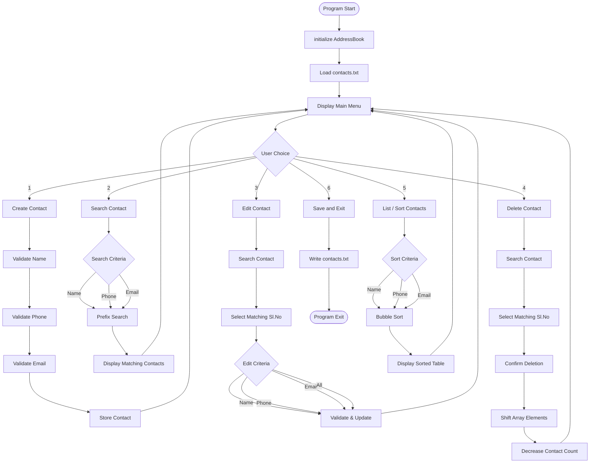

# 📒 Address Book : Contacts Management System

## 📖 Overview

The **Address Book Management System** is a console-based C project that provides a structured way to manage contact information.

The application stores each contact with three fields:

- **Name**
- **Phone number**
- **Email address**

It provides a main menu for:

1. Create Contact
2. Search Contact
3. Edit Contact
4. Delete Contact
5. List / Sort Contacts
6. Save and Exit

The project uses an in-memory `AddressBook` structure for contact management and a `contacts.txt` file for persistent storage. Contacts are loaded from the file when the program starts and saved when the user exits.

## 🎯 Why This Project?

Managing contacts manually can become difficult as the number of records increases. A simple address book application demonstrates how a C program can organize, validate, search, modify, delete, sort, and permanently store structured data through:

- Structures and arrays
- Functions and pointers
- Strings
- Input validation
- Searching and sorting
- File handling
- Menu-driven programming

## 🛠️ Technologies Used

| Technology / Concept | Usage |
|---|---|
| **C** | Core programming language |
| **Structures** | Represents `Contact` and `AddressBook` |
| **Arrays** | Stores up to 100 contacts |
| **Pointers** | Passes the address book to functions |
| **String Handling** | `strlen()`, `strcmp()`, `strncmp()`, `strcpy()` |
| **Character Handling** | `isalpha()`, `isdigit()`, `islower()` |
| **File I/O** | `fopen()`, `fprintf()`, `fscanf()`, `fclose()` |
| **Standard I/O** | `printf()`, `scanf()`, `getchar()` |
| **Terminal ANSI Codes** | Colored and formatted console output |
| **Bubble Sort** | Sorting contacts by selected field |

The source files include standard C headers such as `stdio.h`, `stdlib.h`, `string.h`, and `ctype.h`.

## 🏗️ System Architecture

```text
                 +----------------------+
                 |       main.c         |
                 |    Main Menu / UI    |
                 +----------+-----------+
                            |
                            v
                 +----------------------+
                 |      contact.c       |
                 |                      |
                 | Create               |
                 | Search               |
                 | Edit                 |
                 | Delete               |
                 | List / Sort          |
                 | Validation           |
                 +-----+----------+-----+
                       |          |
                       v          v
              +------------+   +------------+
              | contact.h  |   |   file.c   |
              | Structures |   | Save /Load |
              | Functions  |   +------+-----+
              +------------+          |
                                      v
                               +-------------+
                               | contacts.txt|
                               +-------------+
```

## 🔄 Program Flow



## 📂 Project Structure

```text
Address-Book/
│
├── README.md
├── main.c
├── contact.c
├── contact.h
├── file.c
├── file.h
├── contacts.txt
│
└── screenshots/
    ├── create-contact.png
    ├── search-contact.png
    ├── edit-contact.png
    ├── delete-contact.png
    ├── list-contacts.png
    └── save-exit.png
```

## 🔑 Key Functions

### ➕ Create Contacts:
Create and store new contacts by entering:

- Name
- Phone number
- Email address

The contact details are validated before being stored, including name formatting, phone number format and uniqueness, and email format and uniqueness.

### 🔎 Search Contacts:
Search contacts by:

- Name
- Phone number
- Email address

The search implementation uses prefix matching, so a partial beginning of a name, phone number, or email can match stored records.

### ✏️ Edit Contact:
Edit existing contacts by modifying:

- Name
- Phone number
- Email address
- All contact details

The contact is first selected from the search results, and the updated values are validated before being saved. contact contact

### 🗑️ Delete Contact:
Delete contacts by:

- Searching by name, phone number, or email
- Selecting the required contact from the search results
- Confirming the deletion with Y/y
- Cancelling the operation with N/n

After confirmation, the selected contact is removed and the remaining contacts are shifted to maintain the address-book array.

### ↕️ Sorting:
Contacts can be displayed sorted by:

- Name
- Phone number
- Email address

The implementation copies contacts into a temporary array and applies bubble sort, so the displayed sorting does not directly reorder the original address-book array.

## ✅ Validation:

### 👤 Name:
- Minimum 3 characters
- Only alphabets and spaces
- Cannot start with a space
- No consecutive spaces
- No trailing space

### 📱 Phone:
- Exactly 10 digits
- Only digits
- Must start with 6 to 9
- Spaces are not allowed
- Duplicate numbers are rejected

### 📧 Email:
- Lowercase letters and digits
- One `@` symbol
- One `.` after `@`
- At least one character between `@` and `.`
- Must end with `.com`
- Duplicate email addresses are rejected

## 💾 File Handling:

`contacts.txt` is used for persistent storage.

### 💾 Save:

```text
AddressBook
    |
    v
saveContactsToFile()
    |
    v
contacts.txt
```

### 📥 Load:

```text
contacts.txt
    |
    v
loadContactsFromFile()
    |
    v
AddressBook
```

Save all contacts to contacts.txt and safely exit the application.

The program stores the contact count and all contact details in the file so they can be loaded again when the application starts.

## 🚀 How to Run

### 🔧 Compile

```bash
gcc main.c contact.c file.c -o addressbook
```

### ▶️ Run

```bash
./addressbook
```

Keep `contacts.txt` in the same working directory so saved contacts can be loaded when the program starts.

## 🖥️ Sample Outputs

### ➕ Create Contact

```text
+===============================+
|     ADDRESS BOOK MENU         |
+===============================+
|  1. Create contact            |
|  2. Search contact            |
|  3. Edit contact              |
|  4. Delete contact            |
|  5. List all contacts         |
|  6. Save and Exit             |
+===============================+

Enter your choice: 1

------Create New contact------

-----Enter Contact Details----

Enter name: Naveenkumar Kammar
Enter phone: 8495965878
Enter email: naveenkumarkammar978@gmail.com

Saving...[#####################] 100%
Contact added successfully...
Total contacts stored: 9

Do you want to create another contact? [Yes (Y/y) or No (N/n)]: N

Returning to main menu...
```

### 🔍 Search Contact

```text
------Search for contacts-----

+------------------------------+
|  🔍 Select search criteria   |
+------------------------------+
|  1. 🔍 🔤 Search by name    |
|  2. 🔍 📱 Search by phone   |
|  3. 🔍 📧 Search by email   |
|  4. 🚪 Exit                  |
+------------------------------+
Enter your choice: 1

--------Search by name--------

Enter name: Na

Searching...[##################] 100%

+-------+--------------------------+----------------+-----------------------------------------+
| Sl.No | NAME                     | PHONE          | EMAIL                                   |
+-------+--------------------------+----------------+-----------------------------------------+
| 1     | Naveenkumar Kammar       | 8495965878     | naveenkumarkammar978@gmail.com          |
| 2     | Naveenkumar              | 9874563210     | naveen@gm.com                           |
+-------+--------------------------+----------------+-----------------------------------------+
```

### ✏️ Edit Contact

```text
---------Edit contact---------

--------Search by name--------

Enter name: Na

Searching...[##################] 100%

+-------+--------------------------+----------------+-----------------------------------------+
| Sl.No | NAME                     | PHONE          | EMAIL                                   |
+-------+--------------------------+----------------+-----------------------------------------+
| 1     | Naveenkumar Kammar       | 8495965878     | naveenkumarkammar978@gmail.com          |
| 2     | Naveenkumar              | 9874563210     | naveen@gm.com                           |
+-------+--------------------------+----------------+-----------------------------------------+

Enter the Sl. No. of the contact to edit: 2

-----Contact to be edited-----

+-------+--------------------------+----------------+-----------------------------------------+
| 2     | Naveenkumar              | 9874563210     | naveen@gm.com                           |
+-------+--------------------------+----------------+-----------------------------------------+

Enter your choice: 4

----------Edit by All---------

Enter name: Naveenkumar Kammar
Enter phone: 9380066306
Enter email: navinkumarkammar1530@gmail.com

Editing...[####################] 100%
Contact updated successfully...
```

### 🗑️ Delete Contact

```text
--------Delete contact--------

--------Search by name--------

Enter name: Y

Searching...[##################] 100%

+-------+--------------------------+----------------+-----------------------------------------+
| Sl.No | NAME                     | PHONE          | EMAIL                                   |
+-------+--------------------------+----------------+-----------------------------------------+
| 6     | Yashwant M R             | 7019594855     | yashwantmr@gmail.com                    |
+-------+--------------------------+----------------+-----------------------------------------+

Enter the Sl. No. of the contact to delete (Enter 0 to exit): 6

----Contact to be deleted-----

+-------+--------------------------+----------------+-----------------------------------------+
| 6     | Yashwant M R             | 7019594855     | yashwantmr@gmail.com                    |
+-------+--------------------------+----------------+-----------------------------------------+

Are you sure you want to delete this contact? [Yes (Y/y) or No (N/n)]: Y

Deleting...[###################] 100%
Contact deleted successfully...
```

### 📋 List / Sort Contacts

```text
---------List contacts--------

+------------------------------+
|   📋 Select sort criteria    |
+------------------------------+
|  1. ↕ 🔤 Sort by name        |
|  2. ↕ 📱 Sort by phone       |
|  3. ↕ 📧 Sort by email       |
|  4.🚪 Exit                   |
+------------------------------+

Enter your choice: 1

Loading...[#####################] 100%

================================= ADDRESS BOOK CONTACTS LIST ==================================

+-------+--------------------------+----------------+-----------------------------------------+
| Sl.No | NAME                     | PHONE          | EMAIL                                   |
+-------+--------------------------+----------------+-----------------------------------------+
| 1     | Naveenkumar Kammar       | 8495965878     | naveenkumarkammar978@gmail.com          |
| 2     | Naveenkumar Kammar       | 9380066306     | navinkumarkammar1530@gmail.com          |
| 3     | Prajwal B T              | 7760660755     | prajwalbt@gmail.com                     |
| 4     | Sagar S                  | 9620709925     | sagar@gmail.com                         |
| 5     | Siddesh D S              | 8867283759     | siddesh@gmail.com                       |
| 6     | Varun B R                | 7975748560     | varunbr1968@gmail.com                   |
| 7     | Varun M M                | 8792077968     | varunmm2020@gmail.com                   |
+-------+--------------------------+----------------+-----------------------------------------+

======ADDRESS BOOK STATUS======
Maximum contacts allowed: 100
Contacts stored: 7
Available slots: 93
===============================
```

### 💾 Save and Exit

```text
Enter your choice: 6

Saving and Exiting...[######################] 100%

Address book saved and exit successfully...

THANK YOU!
```

## ⭐ Project Summary

> **Address Book Management System** is a menu-driven C application that provides complete contact management with input validation, prefix-based searching, editing, deletion, sorting, and file-based persistence through `contacts.txt`.


## 👨‍💻 Author

**Naveenkumar Kammar**
